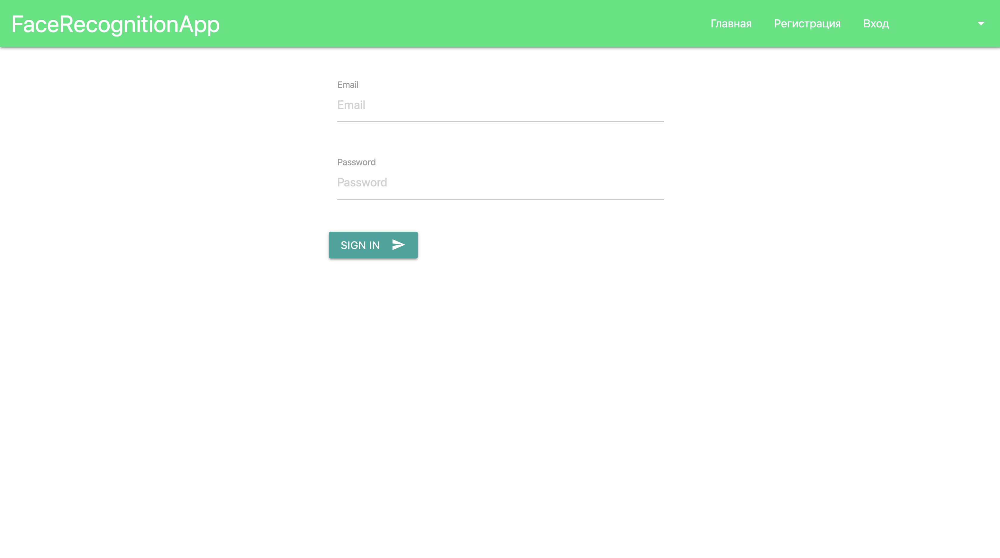
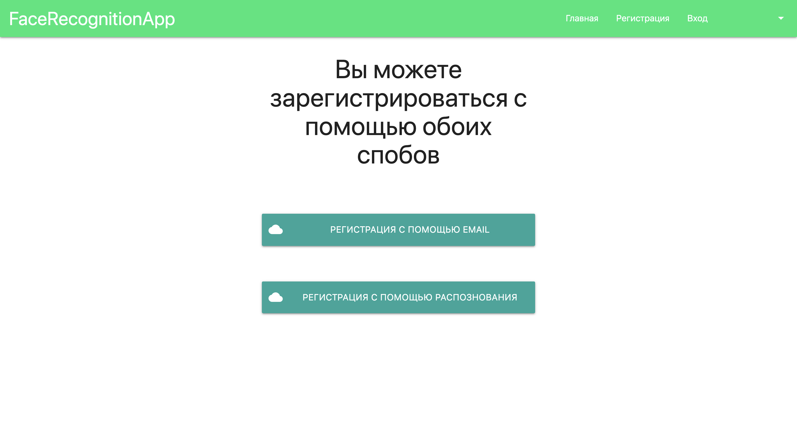
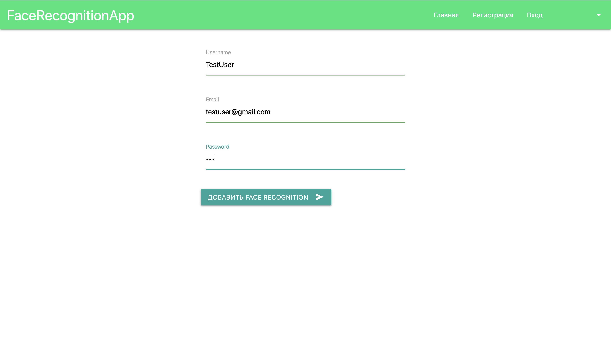
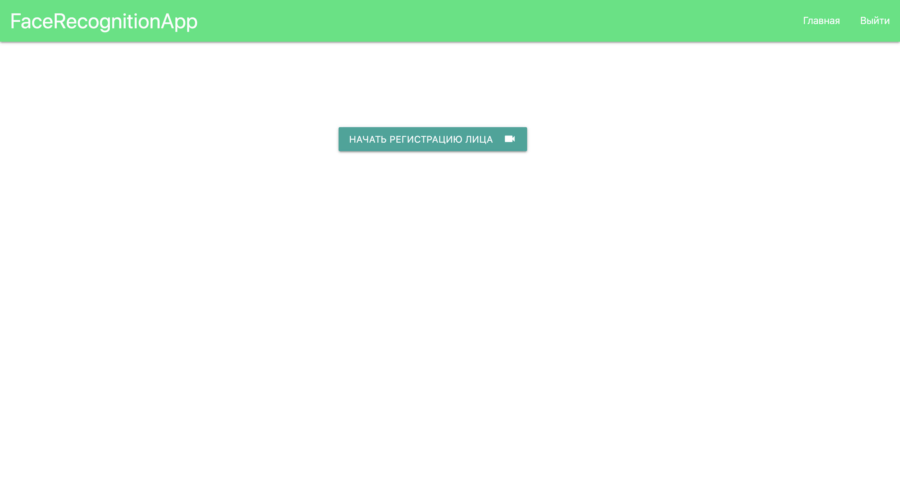

# Component for authorization via face recognition
## Компонент авторизации для входа по лицу.
### Запуск: 
1. npm install
2. npm start

### Мотивация: 
Желание попрактиковаться с webRTC и библиотекой face-api.js

### Приложение

